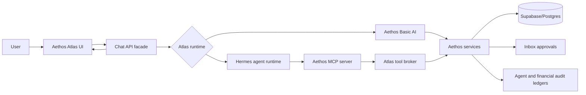
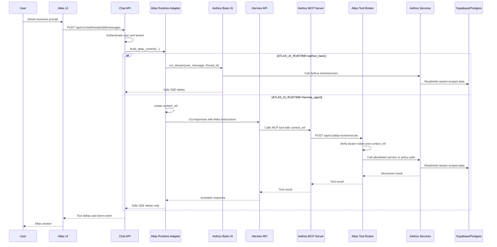
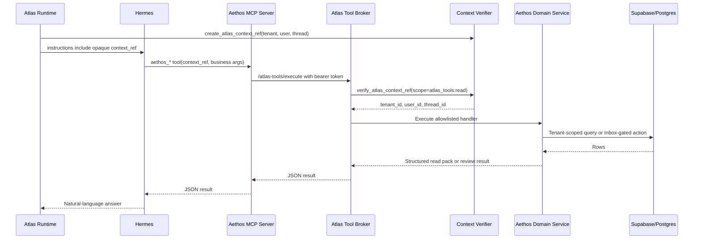
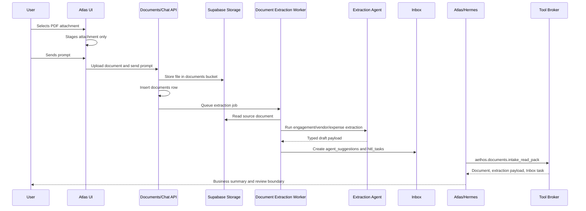
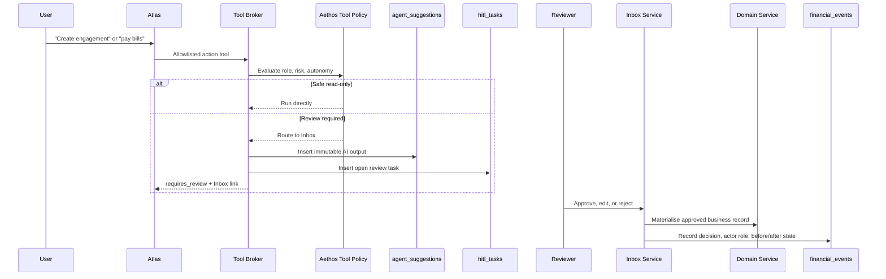

# Aethos Atlas And Hermes AI Agent Architecture

Status: implementation reference
Last updated: 2026-06-29

This document explains how Aethos Atlas works, how Hermes is wired in, how
Atlas tools are built, and which database tables and UI screens participate in
AI-driven finance workflows.

Atlas is the user-facing AI interface. Hermes is an optional advanced agent
runtime behind Atlas. Aethos remains the system of record for tenants, users,
finance data, approvals, calculations, audit, and security.

## Design Rules

- Users interact with **Aethos Atlas**, not internal tools or Hermes.
- Users write business prompts. They do not need to name tools.
- Aethos API chooses the runtime. The browser does not choose it.
- Aethos signs tenant/user context for each Atlas turn.
- Hermes can orchestrate but cannot choose tenant scope.
- All finance truth lives in Aethos tables and services.
- Sensitive writes route through Aethos policy and Inbox review.
- Atlas responses must not show tool calls, raw tool outputs, traces, logs,
  context refs, stack traces, SQL, secrets, or internal request ids.

## Runtime Modes

| Runtime | Config value | Purpose | Implementation |
| --- | --- | --- | --- |
| Aethos Basic AI | `aethos_basic` | Stable built-in Atlas path | `backend/app/agents/copilot/graph.py` |
| Hermes Agent Powered AI | `hermes_agent` | Advanced conversational orchestration and memory | `backend/app/services/atlas_runtime.py` plus `integrations/hermes/` |

Runtime selection is configured by:

```text
ATLAS_AI_RUNTIME=aethos_basic
ATLAS_AI_RUNTIME=hermes_agent
ATLAS_HERMES_FALLBACK_TO_BASIC=false
```

## Main Components

| Component | File or route | Responsibility |
| --- | --- | --- |
| Atlas UI | `frontend/src/app/features/copilot/copilot.component.ts` | Chat, thread list, attachments, response rendering |
| Chat API facade | `backend/app/api/v1/endpoints/chat.py` | Auth, tenant context, thread persistence, runtime adapter call, SSE stream |
| Runtime adapter | `backend/app/services/atlas_runtime.py` | Chooses Basic or Hermes and hides runtime-specific behavior |
| Basic runtime | `backend/app/agents/copilot/graph.py` | Existing Aethos agent loop and policy-aware tools |
| Hermes client | `backend/app/services/hermes_client.py` | Calls private Hermes Responses-compatible API |
| Context signer | `backend/app/services/atlas_context.py` | Creates and verifies short-lived opaque `context_ref` values |
| Tool broker | `backend/app/api/v1/endpoints/atlas_tools.py` | Private allowlisted tool endpoint for Hermes MCP bridge |
| Read packs | `backend/app/services/atlas_read_packs.py` | Compact tenant-scoped business context for Atlas |
| Hermes MCP server | `integrations/hermes/aethos_mcp_server.py` | Exposes Aethos tools to Hermes as MCP tools |
| Hermes profile | `integrations/hermes/aethos-atlas-profile/` | Atlas persona, skills, and MCP config |
| Inbox service | `backend/app/services/inbox_service.py` | Human-in-the-loop approval and materialisation |
| Observability | `backend/app/agents/base.py`, `docs/infra/LANGFUSE_OBSERVABILITY.md` | Langfuse model tracing and Aethos internal ledgers |

## High-Level Interaction



## Chat Request/Response Flow



## Hermes Tool Call Flow



## Document Upload And Extraction Flow



Key behavior:

- Attachment selection in the UI only stages the file.
- Extraction starts after the user sends a prompt or uploads through the
  Documents flow.
- Atlas reads extraction output through `aethos.documents.intake_read_pack`.
- Atlas should not ask the user to retype data already present in the
  extraction payload or linked Inbox task.

## Human-In-The-Loop Write Flow



## Tool Broker Contract

The internal endpoint is:

```text
POST /api/v1/atlas-tools/execute
Authorization: Bearer <AETHOS_HERMES_TOOL_TOKEN>
```

Request shape:

```json
{
  "context_ref": "ctx_...",
  "tool_name": "aethos.engagements.structure_read_pack",
  "arguments": {
    "client_name": "Nexus"
  }
}
```

The broker:

1. Validates the private bearer token.
2. Verifies `context_ref` with `atlas_tools:read` scope.
3. Ignores tenant/user values passed by the model.
4. Dispatches only allowlisted tool names.
5. Calls Aethos services with the verified tenant and user.
6. Returns structured results to Hermes.

Write-capable tools do not give Hermes direct database write access. They call
existing Aethos policy and Inbox review paths.

## Current Tool Catalog

| Internal broker tool | MCP wrapper | Purpose | Primary backend path |
| --- | --- | --- | --- |
| `aethos.documents.intake_read_pack` | `aethos_documents_intake_read_pack` | Document metadata, extraction payload, linked Inbox task | `AtlasReadPackService.document_intake_read_pack` |
| `aethos.documents.audit_read_pack` | `aethos_documents_audit_read_pack` | Source document lineage for audit prompts | `AtlasReadPackService.documents_audit_read_pack` |
| `aethos.engagements.list` | `aethos_engagements_list` | Engagement list | `EngagementService.list_engagements` |
| `aethos.engagements.structure_read_pack` | `aethos_engagements_structure_read_pack` | Engagements, projects, workstreams, billing terms, missing setup | `AtlasReadPackService.engagement_structure_read_pack` |
| `aethos.engagements.create_review` | `aethos_engagements_create_review` | Prepare engagement draft for Inbox approval | `write_agent_suggestion` and Inbox materialisation |
| `aethos.delivery.resource_read_pack` | `aethos_delivery_resource_read_pack` | Employee time, pending/approved status, expenses, utilization, invoice-ready WIP | `AtlasReadPackService.resource_delivery_read_pack` |
| `aethos.time.log_entry` | `aethos_time_log_entry` | Log time through policy-controlled Aethos path | `CopilotAgent._execute_tool_with_policy("log_time_entry")` |
| `aethos.finance.ar_aging` | `aethos_finance_ar_aging` | AR aging | `ReportsService.ar_aging` |
| `aethos.finance.ap_aging` | `aethos_finance_ap_aging` | AP aging | `ReportsService.ap_aging` |
| `aethos.finance.wip` | `aethos_finance_wip` | WIP | `ReportsService.wip` |
| `aethos.finance_ops.snapshot` | `aethos_finance_ops_snapshot` | AR, AP, WIP, active engagement snapshot | `ReportsService`, `EngagementService` |
| `aethos.finance_ops.control_room` | `aethos_finance_ops_control_room` | Scheduled Finance Ops Manager state | `AgentsService.get_finance_ops_control_room` |
| `aethos.finance_ops.create_action_plan` | `aethos_finance_ops_create_action_plan` | Create manager-level action plan for Inbox | `CopilotAgent._execute_tool_with_policy` |
| `aethos.o2c.draft_invoice` | `aethos_o2c_draft_invoice` | Draft invoice to Inbox | `CopilotAgent._execute_tool_with_policy` |
| `aethos.o2c.collections_read_pack` | `aethos_o2c_collections_read_pack` | Invoice and collections drilldown | `O2CReadService.collections_read_pack` |
| `aethos.collections.draft_reminders` | `aethos_collections_draft_reminders` | Draft collection reminders to Inbox | `CopilotAgent._execute_tool_with_policy` |
| `aethos.p2p.payment_risk_read_pack` | `aethos_p2p_payment_risk_read_pack` | Vendor bill and payment readiness | `P2PReadService.payment_risk_read_pack` |
| `aethos.p2p.propose_bill_payment_batch` | `aethos_p2p_propose_bill_payment_batch` | Bill-pay batch to Inbox | `CopilotAgent._execute_tool_with_policy` |
| `aethos.r2r.management_pack_read_pack` | `aethos_r2r_management_pack_read_pack` | R2R close and management-pack context | `R2RReadService.management_pack_read_pack` |
| `aethos.r2r.prepare_month_end_close` | `aethos_r2r_prepare_month_end_close` | Month-end close review | `CopilotAgent._execute_tool_with_policy` |
| `aethos.r2r.prepare_year_end_close` | `aethos_r2r_prepare_year_end_close` | Year-end close review | `CopilotAgent._execute_tool_with_policy` |
| `aethos.r2r.generate_financial_statement_package` | `aethos_r2r_generate_financial_statement_package` | Read-only financial statement package | `CopilotAgent._execute_tool_with_policy` |
| `aethos.r2r.accounting_decision_trail_read_pack` | `aethos_r2r_accounting_decision_trail_read_pack` | Inbox decision trail, journal context, segregation controls | `AtlasReadPackService.accounting_decision_trail_read_pack` |
| `aethos.approval_controls.read_pack` | `aethos_approval_controls_read_pack` | Role-aware approval controls | `AgentsService.get_approval_controls_read_pack` |
| `aethos.operational_health.read_pack` | `aethos_operational_health_read_pack` | Safe health, Langfuse status, rate limits, failures | `AtlasReadPackService.operational_health_read_pack` |

## Database Tables By Flow

### Chat And Runtime

| Table | Used by | Purpose |
| --- | --- | --- |
| `chat_threads` | Chat API, Atlas UI | User-visible Atlas conversation threads |
| `chat_messages` | Chat API, Atlas UI | Persisted user and assistant messages |
| `tenants` | Auth, runtime, all tools | Tenant scope and subscription/config context |
| `tenant_users` | Auth/RBAC, context, policy | User membership and role per tenant |
| `employees` | Time, delivery, approvals | People records, user mapping, bill rates |

### Documents And Extraction

| Table/storage | Used by | Purpose |
| --- | --- | --- |
| `documents` | Documents API, extraction worker, Atlas read packs | Source document metadata, classification, entity linkage, extraction state |
| `storage.objects` in `documents` bucket | Documents API, worker | Actual uploaded document bytes |
| `agent_suggestions` | Extraction agents, Inbox, Atlas read packs | Immutable AI output snapshot |
| `hitl_tasks` | Inbox, Atlas read packs | Human-facing review queue |
| `agent_corrections` | Inbox edits/rejections | Training and correction signal |

### O2C And Engagement Delivery

| Table | Used by | Purpose |
| --- | --- | --- |
| `clients` | Engagements, invoices, collections | Customers and vendors |
| `engagements` | O2C, projects, reports | Commercial contract container |
| `engagement_billing_terms` | Invoicing, read packs | Fixed fee, retainer, cap, unit billing terms |
| `rate_cards` | Engagements, billing | Rate-card header |
| `rate_card_lines` | Billing and WIP | Role/rate rows |
| `rate_card_client_overrides` | Billing | Client-specific rate overrides |
| `projects` | Delivery, WIP, invoices | Workstreams under engagements |
| `project_assignments` | WIP and utilization | Resource assignment and rate override |
| `time_entries` | Time, WIP, invoicing | Approved/pending hours and billing status |
| `project_expenses` | Expenses, WIP, invoicing | Billable or non-billable project costs |
| `invoices` | AR, collections, payments | AR documents and status |
| `invoice_lines` | Invoices, WIP billing | Invoice detail, time/expense linkage |
| `payments` | AR payment and FX | Customer payments |
| `collections_policies` | Collections read packs | Reminder cadence and tone rules |

### P2P

| Table | Used by | Purpose |
| --- | --- | --- |
| `bills` | AP, payment risk | Vendor bills |
| `bill_lines` | AP coding | Bill coding and tax detail |
| `bill_payment_batches` | Bill pay | Batch header and payment-file state |
| `bill_payment_items` | Bill pay | Bills included in a batch |
| `procurement_documents` | Procurement controls | Purchase requests/orders and service orders |
| `procurement_document_lines` | Procurement controls | Procurement line detail |

### R2R, Audit, And Operations

| Table | Used by | Purpose |
| --- | --- | --- |
| `accounts` | Journals/reports | Chart of accounts |
| `journal_entries` | GL, R2R, decision trail | Journal header, period, posting state |
| `journal_lines` | GL/reports | Debit/credit lines |
| `period_locks` | R2R close | Locked accounting periods |
| `accounting_close_tasks` | Close | Close checklist tasks |
| `accounting_close_overrides` | Close | Controlled lock-blocker overrides |
| `financial_events` | Inbox/audit | Decision events with before/after state |
| `agent_runs` | Agent ledger | Agent run evidence |
| `agent_tool_invocations` | Agent ledger | Tool invocation evidence |
| `agent_workflow_runs` | Workflow control room | Long-running workflow state |
| `rate_limit_events` | Operational health | Abuse/rate-limit evidence |
| `webhook_events` | Integrations | Inbound webhook processing evidence |
| `procrastinate_jobs` and related `procrastinate_*` tables | Worker queue | Background job state |

### Master/Configuration Tables

| Table | Purpose |
| --- | --- |
| `fx_rates` | Multi-currency reporting and journal conversion |
| `tax_rates` | Tax calculation and invoice/bill coding |
| `service_catalogue` | Service-line/productized billing metadata |
| `agent_autonomy_settings` | Agent autonomy level per action |
| `agent_tool_controls` | Tool kill switches and controls |
| `approval_policy_settings` | Approval thresholds and role rules |
| `finance_ops_manager_settings` | Scheduled Finance Ops Manager cadence |

## UI Screens By Flow

| Screen | Route | Role in AI flow |
| --- | --- | --- |
| Aethos Atlas | `/app/copilot` | Prompting, attachments, AI answers, safe links to review surfaces |
| Documents | `/app/documents` | Uploaded source documents, extraction state, document lineage |
| Inbox | `/app/inbox` | HITL review, approve/edit/reject, decision history |
| Engagements | `/app/engagements` | Engagement records, billing model, service line, source document linkage |
| Projects | `/app/projects` | Workstreams under engagements |
| Time | `/app/time` | Main ERP time entries |
| Timesheet portal | `https://timesheet.aethos.ishirock.tech` | Worker-facing time entry portal |
| Approvals | `/app/approvals` | Timesheet approval workflow |
| Expenses | `/app/expenses` | Project expense review |
| Invoices | `/app/invoices` | Draft/approved/sent/paid invoices |
| Payments | `/app/payments` | AR receipts and payment evidence |
| Bills | `/app/bills` | Vendor bills and coding |
| Billing Runs / Pay Bills | `/app/billing-runs` | Billing runs and bill-payment preparation |
| Reports | `/app/reports` | AR/AP aging, WIP, P&L, utilization, trial balance, financial statements |
| Accounting Journals | `/app/accounting/journals` | Manual journals, reversals, posted/draft journal evidence |
| Settings | `/app/settings` | Agent settings, autonomy, workflow runs, operational health surfaces |
| People | `/app/people` | Employees, practice areas, rates |
| Contacts | `/app/clients` | Customers/vendors |

## How To Add A New Atlas Tool

1. Define the business capability in Aethos terms, not model terms.
2. Choose the safety class:
   - read-only read pack
   - write proposal routed to Inbox
   - direct write only if existing Aethos policy permits it
3. Implement the tenant-scoped service:
   - read packs usually live in `backend/app/services/atlas_read_packs.py`
   - domain calculations should live in the existing domain service
   - write actions should reuse `CopilotAgent._execute_tool_with_policy` or
     existing domain APIs and Inbox materialisation
4. Add a handler in `backend/app/api/v1/endpoints/atlas_tools.py`.
5. Register the handler in `_TOOL_DISPATCH`.
6. Add an MCP wrapper in `integrations/hermes/aethos_mcp_server.py`.
7. Update the Hermes Atlas profile skill if Hermes needs stronger routing
   instructions for the new capability.
8. Add broker contract tests in
   `backend/tests/unit/test_atlas_tools_api_contract.py`.
9. Add service-level tests for the read pack or domain service.
10. Update the demo guide, prompt library, and platform user guide when the
    user-facing behavior changes.

## Security And Governance Boundaries

| Risk | Control |
| --- | --- |
| Model tries to pass a tenant id | Broker ignores model-supplied tenant/user values and uses verified `context_ref` |
| Tool token leaks to browser | Tool broker token is server-to-server only and never emitted to UI |
| Hermes exposes tool internals | Atlas runtime forwards only safe assistant text and user-facing artifacts |
| Write action bypasses review | Write-capable broker tools call Aethos policy and Inbox paths |
| Extraction prompt injection | Extraction agents mark suspected injection and force HITL |
| Raw traces/logs exposed | Operational health read pack returns counters/status only |
| Cross-tenant reads | Service role calls are explicitly tenant-scoped by verified context |
| Posted journal mutation | Database trigger prevents editing posted journals; reversals create new entries |

## Testing Strategy

| Layer | Tests |
| --- | --- |
| Context signing | `backend/tests/unit/test_atlas_context.py` |
| Tool broker contract | `backend/tests/unit/test_atlas_tools_api_contract.py` |
| Hermes client | `backend/tests/unit/test_hermes_client.py` |
| Basic Atlas chat contract | `backend/tests/unit/test_chat.py`, `backend/tests/unit/test_chat_api_contract.py` |
| Inbox materialisation | `backend/tests/unit/test_bills_and_inbox.py` |
| Domain read packs | service-specific unit tests |
| Browser demo proof | `frontend/e2e/demo-v2-production-validation.spec.ts` |

## Operational Verification

Local focused backend verification:

```bash
cd backend
uv run ruff check app/api/v1/endpoints/atlas_tools.py app/services/atlas_read_packs.py ../integrations/hermes/aethos_mcp_server.py
uv run pytest tests/unit/test_atlas_context.py tests/unit/test_atlas_tools_api_contract.py tests/unit/test_hermes_client.py -q
```

Production smoke:

```bash
curl https://aethos.ishirock.tech/health
curl https://aethos.ishirock.tech/api/v1/ping
curl https://timesheet.aethos.ishirock.tech/health.txt
```

Hermes runtime smoke:

1. Set `ATLAS_AI_RUNTIME=hermes_agent`.
2. Confirm Hermes container is running privately on the Docker network.
3. Confirm `AETHOS_HERMES_TOOL_TOKEN` matches API and Hermes MCP env.
4. Ask Atlas for:
   - engagement structure
   - document intake summary
   - Alice Chen delivery data
   - operational health
   - decision trail
5. Verify the user sees business answers only, not tool names or traces.
